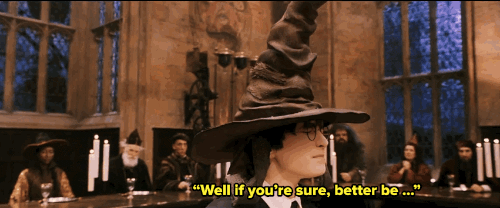

```{r setup, include=FALSE}
knitr::opts_chunk$set(echo = TRUE)
library(googlesheets)
library(tidyverse)
library(magrittr)
library(recipes)
```

## Overview

As part of the challenge of the month we collected data internally in order to sort individuals into Hogwarts Houses.

I thought it would be fun to start playing with the data in R!



<!-- ## Load the data -->

<!-- ### Try from googlesheets -->

```{r, eval=FALSE}
gs_ls()
```

<!-- Firewall blocks -->

<!-- ### Dump to drive and load -->

<!-- Put the data into the stats_team folder -->

```{r,include=FALSE}
hogwarts_data <- 
  data.table::fread("~/t-drive/Internal/Stats_team/Eighty20/Hogwarts_data/Hogwarts house challenge.csv") %>% tbl_df()

hogwarts_data %>% head
```

<!-- ## Data augmentation? -->

<!-- 80Talks exist with possible name and title in the file_name;   -->
<!-- <T:\t-drive\Eighty20 Culture\80Talks>   -->

<!-- All 8020 awards exist as powerpoint slides;   -->
<!-- <T:\t-drive\Eighty20 Culture\Awards>   -->

<!-- I have joined some of the rewards free text into the data;   -->
<!-- <T:\t-drive\Internal\Stats_team\Eighty20\Hogwarts_data\Hogwarts_house_challenge_augmented.csv>   -->

## Summarise data

### Distribution of affinity to each house

```{r}
hogwarts_data %>% 
  select(-top_house,-in_desired,-`Whichhousedidyouwanttobein?`,-`Whichhousedidyouthinkyouwouldbein?`) %>% 
  gather(key = "House",value = "Affinity",Gryffindor,Hufflepuff,Ravenclaw,Slytherin) %>% 
  ggplot()+
  geom_bar(aes(x = House,y=Affinity %>% reorder( -table(Affinity)[Affinity]),fill=Name),position = "dodge", stat = "identity")+
  ggtitle("Affinity to each house by name")+
  ylab("Affinity")
```

### Number of people in each house

```{r}
hogwarts_data %>% 
  group_by(top_house) %>% 
  tally %>% 
  ggplot()+
  geom_bar(aes(x = top_house,y=n, fill = top_house),position = "dodge", stat = "identity")+
  ggtitle("Number of members in each house")
  # geom_text(aes(x = top_house, y = n, label = hogwarts_data$Name, group = Name),
                  # position = position_stack(vjust = .5))
```

### Cross tabulation of each person's top house VS desired house

```{r}
hogwarts_data %>% 
  group_by(top_house,`Whichhousedidyouwanttobein?`) %>% 
  tally() %>% 
  spread(key = `Whichhousedidyouwanttobein?`,value = n,fill = 0)
```

### Cross tabulation of each person's top house VS expected house

```{r}
hogwarts_data %>% 
  group_by(top_house,`Whichhousedidyouthinkyouwouldbein?`) %>% 
  tally() %>% 
  spread(key = `Whichhousedidyouthinkyouwouldbein?`,value = n,fill = 0)
```

## Exploration

### Correlations between houses predicted

```{r}
hogwarts_data[,3:6] %>% 
  as.matrix() %>% 
  cor() %>% 
  corrplot::corrplot()
```

People scoring high affinity towards gryffindor often score low affinity towards Ravenclaw. Other than that there aren't all that many interesting correlations  

### Correlations between top house and desired house

```{r}
clean_desired_house <- function(list_in,desired) {
# list_in <- list(Gryffindor = 80, Hufflepuff = 80,Ravenclaw = 20, Slytherin = 20)
  # browser()
  names_in <- c("Gryffindor" , "Hufflepuff" ,"Ravenclaw" , "Slytherin" )
  max_out <- which(list_in == list_in %>% flatten_dbl() %>% max)
  
    desired_house <- ifelse(any(names_in[max_out] == desired),TRUE,FALSE)
}

clean_top_house <- function(list_in,desired) {
# list_in <- list(Gryffindor = 80, Hufflepuff = 80,Ravenclaw = 20, Slytherin = 20)
  # browser()
  names_in <- c("Gryffindor" , "Hufflepuff" ,"Ravenclaw" , "Slytherin" )
  max_out <- which(list_in == list_in %>% flatten_dbl() %>% max)
  
    desired_house <- ifelse(any(names_in[max_out] == desired),TRUE,FALSE)
    
    # if(desired_house){
    #   return(desired)
    # } else 
      if(length(max_out)>1){
      return("multiple_top_houses")
    } else {
      return(names_in[max_out])
    }
}

hogwarts_data %<>% 
  setNames(names(.) %>% stringr::str_remove_all("%| ")) %>% 
  mutate(in_desired = pmap_lgl(.,~clean_desired_house(list_in = list(..3,..4,..5,..6),desired = ..7))) %>% 
  mutate(top_house = pmap_chr(.,~clean_top_house(list_in = list(..3,..4,..5,..6),desired = ..7)))

hogwarts_data %>% 
  select(top_house,`Whichhousedidyouwanttobein?`) %>% 
  table %>% 
  cor() %>% 
  corrplot::corrplot()
```

Now we start seeing more interesting correlations.  

Apparently people who want to be in Ravenclaw often end up in Slytherin and vice versa. More over, these people don't often get associated with Hufflepuff.  

On the contrary people who end up in Hufflepuff often have no idea where they want to be (I know... big surprise)

### Correlations between top house and expected house

```{r}
hogwarts_data %>% 
  select(top_house,`Whichhousedidyouthinkyouwouldbein?`) %>% 
  table %>% 
  cor() %>% 
  corrplot::corrplot()
```

Here we see something a little different. People who have no idea where the hat will put them are almost never placed in slytherin. Also, expectations towards Hufflepuff infer low expectations for gryffindor and vice versa.  

Odly enough, even though we said people who don't know where they want to be end up in Hufflepuff; these people seem to think they are gona end up in either Gryffindor or Ravenclaw

### Visualize similarity of people

```{r}
pca_recipe <- function(data){
  data %>% 
  recipe %>% 
  step_pca(all_numeric(),num = 2) %>% 
  prep %>% 
  bake(newdata = data)
}

plot_data <- 
hogwarts_data %>% 
  pca_recipe %>% 
  mutate(intensity = PC1+PC2)

plot_data %>% 
  ggplot() +
  geom_point(aes(col = intensity,x = PC1,y=PC2))+
  geom_text(label = paste(plot_data$Name,plot_data$Surname),aes(x=PC1,y=PC2),check_overlap = F,hjust=1.1,position=position_jitter(width = 1.1,height = 1.1))+
  xlim(c(-160,-80))+
  ggtitle("Similarity of people using PCA on numeric responses")+
  theme_bw()+
  theme(legend.position="none")
  # theme(legend.position="none",panel.background = element_blank())
  
```
